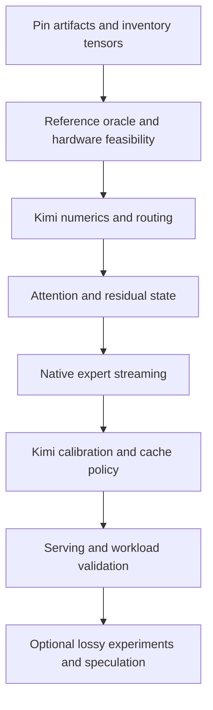

# Implementation plan: Kimi K3 NVFP4 on Spark

Status: proposal, not implemented. Date: 2026-09-15. See the
[model comparison](model-comparison.md) for primary sources and pinned revisions,
and [methodology analysis](repository-methodology.md) for the inherited code.

## Objective and success criteria

Determine whether the complete NVIDIA checkpoint can produce correct text on one
DGX Spark using native-format experts, a bounded resident cache, and local NVMe.
Correctness comes before speed. A successful port must identify its checkpoint,
reproduce reference routing and numerics within declared tolerances, survive
repeated requests within the memory budget, and publish end-to-end measurements.
A feasibility result that rejects single-Spark serving is valid; a successful
model load alone is not successful inference.

Keep three separately named experiments: native checkpoint streaming, native
checkpoint with optimized caching, and explicitly lossy pruning/requantization.
Do not reuse DeepSeek keep sets or label CB3 results NVFP4-equivalent.

## Dependencies and sequence



### 0. Pin the model and establish an honest configuration boundary

Deliver a manifest containing model and tokenizer revisions, quantization config,
weight index, tensor dtypes/shapes/byte counts, runtime version, patch revision,
and container digest. Inspect metadata before downloading approximately 1.6 TB.
Account for download staging, temporary repacks, and backups as separate disk costs.
Do not commit weights, credentials, or external model code without provenance.

Add explicit model-family dispatch to the loader/server; reject a Kimi config on
the V4.1 path before allocating weights. Preserve the inherited DeepSeek engine
as a regression baseline. A proposed `engine/kimi_engine.py` should implement the
existing `Engine` transport contract, with model-specific tokenization and state
behind that boundary. Proposed filenames in this plan do not exist yet.

Acceptance: metadata inventory resolves every required tensor, unsupported
formats fail clearly, and a smoke command reports the selected model family and
revision without silently falling back to DeepSeek defaults.

### 1. Establish a reference oracle and a hardware go/no-go gate

Use the pinned NVIDIA-supported serving configuration on suitable hardware, or
obtain reproducible reference traces from it. The published B300 configuration
is an oracle candidate, not a GB10 installation recipe. Record GPU architecture,
CUDA and kernel versions; check whether each required operation compiles and
runs on GB10. Use tiny tensor fixtures before attempting a full model launch.

Capture token IDs, selected experts, weights, per-layer residual outputs, and
final logits for fixed inputs. Include ordinary text, code, multilingual text,
longer prefixes, and each supported reasoning setting. Keep generated traces
separate from calibration and evaluation data. Without an oracle, report
structural checks only and block correctness claims.

Compute memory from the actual inventory:

```
expert_budget = available_unified_memory
                - always_resident_weights
                - attention_and_recurrent_state(context, concurrency)
                - peak_activations - staging_buffers - runtime_overhead
                - safety_reserve
resident_fraction = expert_budget / total_expert_storage
```

K3 has 92 MoE layers, 896 experts per layer and 16 active experts per token.
That is 82,432 expert identities and 1,472 routed selections per token before
batch reuse, versus 15,360 and 240 in the inherited DeepSeek decode path.
These counts do not determine speed: byte size, shared/latent projections,
cache reuse, and attention costs must also be measured.

A rough storage lower bound is 2.8e12 parameters * 0.5 bytes = 1.4 TB before
scales and higher-precision tensors. Even assigning all 128 GB to that payload
would retain only about 9.1%; actual expert residency needs the detailed budget
above. This is a sanity check, not an expert-cache capacity prediction.

For each decode step measure distinct misses and actual read bytes:

```
read_bytes = sum(stored_bytes[expert] for distinct missed experts)
io_time_lower_bound = read_bytes / measured_effective_read_bandwidth
```

Do not substitute SSD headline bandwidth or DeepSeek's miss ratio. Measure
single-read latency, queue depth, thermal steady state, staging/copy time, and
prefill separately. Stop or revise the hardware scope if non-expert state cannot
fit, native kernels are unavailable, or measured latency is impractical. Any
multi-node alternative needs its own memory and communication study.

### 2. Implement the quantization and expert math boundary

Create a format descriptor carrying packed dtype, group size, scale hierarchy,
activation-scale semantics, tensor orientation, fused projection order, and
alignment. Do not reinterpret the existing UE8M0/group-32 buffers as NVFP4.
Read NVIDIA's mixed-quantization metadata per tensor: routed NVFP4 experts and
FP8 block-scaled projections require different execution paths.

Build a small, clear dequantized reference before optimizing. Implement Stable
LatentMoE projections and SiTU using the exact source formulas and scale placement;
porting a SwiGLU kernel by shape alone is insufficient. Preserve RMS normalization
of the combined routed output before projection back to model width. Because
that normalization depends on the mixture, individual post-projection expert
contributions are not independently additive; validate complete blocks and
sampled leave-one-expert-out effects as well. Include shared experts
and all retained-precision tensors in both numerical and memory accounting.

Acceptance: known packed values, scale extremes, tensor transposes, fused
projection order, and complete expert outputs agree with the pinned reference.
Set absolute/relative error thresholds from reference precision and measured
error distributions before running evaluation, rather than relaxing them after
failures. Test non-finite outputs and accumulation precision explicitly.

### 3. Implement the Kimi router without cache-driven changes

Use Kimi's sigmoid scores, selection-only correction bias, top-16 selection,
unbiased normalization, and configured routed scaling. Validate ties and
numerically close scores against the reference implementation. The inherited
sqrt-softplus/top-6/scale-1.5 router must remain on the DeepSeek path.

The router emits model expert IDs and combination weights. The store maps IDs
to slots without changing those IDs or weights. Expose selected IDs before slot
translation so trace data cannot confuse storage placement with model routing.

Acceptance: exact selected IDs on non-tie fixtures, defined tie behavior,
reference-close weights, and identical outputs whether an expert was already
resident or loaded on demand. No pruning in this baseline.

### 4. Implement attention, residuals, and request state

Port KDA, gated MLA, and AttnRes using the pinned layer schedule and tensor schema.
Remove assumptions about DeepSeek's CED prefill shortcut, CSA2 global caches,
Engram, mHC, and DSpark from the Kimi path. KDA recurrent state and MLA cache
need separate sizing and lifecycle rules; DeepSeek's context-memory estimates
cannot be reused.

First support single-sequence autoregressive text generation with speculation
disabled. Define reset, chunked-prefill, cancellation, and teardown semantics.
Plan explicit snapshot/rollback support before attempting speculative decoding
or shared prefix caches; recurrent state cannot be treated as an append-only KV
array without proving equivalence.

Acceptance: layer-wise and final-logit comparisons; one-shot versus chunked
prefill; prompt A then prompt B without leakage; cancellation then another
request; context-boundary rejection before allocation; repeated-run memory
measurements. Use hardware execution when testing GPU behavior.

### 5. Generalize expert storage and implement native streaming

Refactor `engine/experts.py` around descriptor-derived sizes and index-derived
byte runs. Kimi's fused tensor layout must be inspected rather than assuming
DeepSeek's six tensors or two contiguous runs per expert. If repacking is needed,
make a reversible, checksummed native-format layout with original tensor mapping;
repacking must not silently change numerical precision.

Retain the useful separation between decode LRU residency and prefill scratch
storage. Pin all slots used by in-flight kernels and explicitly synchronize
reuse with GPU completion. Derive scratch requirements from the actual distinct
expert working set; neither the old 400-slot streaming ring nor eight-slot
pruned configuration is a Kimi-safe default. Use bounded batches if a full
layer cannot fit in scratch space.

Acceptance: streamed-versus-resident parity, repeat misses, eviction under
pressure, short reads, aligned boundary reads, cancellation, and slot lifetime
checks. Benchmark O_DIRECT against buffered reads on the target filesystem;
choose from measurements and account for host page cache in unified memory.

### 6. Collect Kimi traces and select a resident set

Regenerate calibration traces on the unpruned Kimi baseline, covering prompt
prefill and free-running decode, code, reasoning, multilingual text, and mixed
agent tasks. Store model revision, layer/expert dimensions, routing rule,
quantization, corpus provenance, sample counts, and phase in a versioned schema.
Reject traces whose identity or geometry does not match the loaded model.

Start with frequency and weighted output-norm statistics, retaining both sums
and counts so total saliency and conditional-mean saliency are distinguishable.
Evaluate output contribution in the correct latent/output space; specify whether
shared output projections are included. Revalidate `sum`, `max`, and `maxmin`
rankings for Kimi rather than inheriting the old winner.

For variable-size experts, rank placement by saved read cost per resident byte,
then compare static warm start, LRU, and alternative adaptive policies on held-out
sessions. Simulate trace misses and verify predictions with actual serving.
Cache policy must leave model routing unchanged. A cache hit rate of 1.0 after
pruning does not prove full-model coverage or preserved quality.

Acceptance: trace schema checks, reproducible keep sets, held-out workload
coverage, real miss-byte/latency measurements, and unchanged baseline numerics.

### 7. Integrate serving and publish reproducible evidence

Split transport from model-specific chat templates, stop tokens, reasoning
settings, and tool parsing in `server/app.py` and `server/tool_grammar.py`.
Use Kimi's tokenizer/template and parser contract; do not feed it DSML grammar
or DeepSeek's numeric effort prefix. Validate low/high/max semantics against the
pinned Kimi implementation. Reject image/video requests clearly until the
multimodal processor and execution path are implemented and verified.

Publish a matrix of context lengths, generation lengths, workloads, memory
budgets, cache policies, and cold/warm runs. Report startup, TTFT, prefill rate,
decode rate, p50/p95 request latency, peak host/GPU memory, SSD bytes/token,
expert hits/misses, and failures. Preserve full configuration and artifact hashes.
Separate tokenizer/HTTP mock tests from real inference results.

Quality gates include teacher-forced loss and logit comparisons plus held-out
free generation: syntactically valid code, tool-call parse success, repetition,
completion rate, multilingual quality, and long reasoning beyond short smoke
tests. Calibrate numerical tolerance and define workload pass/fail thresholds
before comparing configurations. Keep failed cases in results.

Acceptance: repeated requests succeed on the target hardware within the stated
budget, generation gates pass, measurements are reproducible, and documented
limits match observed behavior. Only then replace the README's unsupported
status with a narrowly scoped support claim.

### 8. Optional experiments after the native baseline

Evaluate expert pruning, CB3 or another requantization format, speculative
execution, multimodal input, and multi-node serving independently. Each changes
a different part of the correctness/performance contract and needs its own
reference comparisons. If pruning is explored, compare substitution and drop
semantics with full routing and measure domain-specific regression; neither is
quality-preserving by definition. Drafting requires a compatible Kimi drafter
and correct rollback of every state type, not reuse of DSpark weights.

## Deliverables and rollback

Land future work in independently reviewable PRs following the numbered gates:
manifest/dispatch, numerical primitives, model state, storage, calibration,
serving, then optional experiments. Each PR records its reference revision,
validation commands, hardware used, failed cases, and remaining blockers.
Keep the DeepSeek backend selectable until the Kimi gates pass. On a failed
numerical or memory gate, return to the last passing configuration and retain
the failure evidence; do not compensate by silently dropping experts, lowering
precision, or shortening user requests.

This documentation PR changes no runtime behavior and provides no schedule or
throughput promise. Hardware availability, native kernel support, non-expert
memory, and measured NVMe traffic determine whether the intended port is viable.
